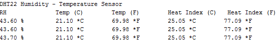

# Montaje 8 Medición T y H por puerto serie

### Programa con DHT11:

El resultado se puede ver en este vídeo, simplemente soplando el vaho pasamos de 20% de humedad y 22ºC a 93% y 24ºC.

Si lo hacéis con niños, enseguida se les ocurre ponerlo en el sobaco ;)

https//www.youtube.com/watch?v=gLxdSaxOJbY?rel=0
### Programa con DHT12

La librería de este sensor es más potente y nos puede decir la sensación térmica:

El resultado es:

