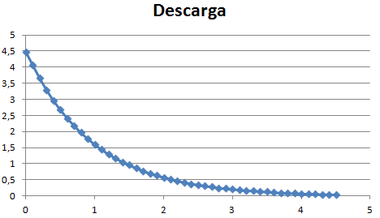

# Montaje 9: Descarga del condensador

Si has hecho [el montaje anterior](montaje_8_carga_de_un_condensador.html), terminarás con el condensador** totalmente cargado**, procede con el mismo programa que va leyendo A5 a desconectar el cable amarillo de 5V y conectarlo a GND entonces el condensador se irá descargando a masa.

## SIN EDUBASICA

##CON EDUBÁSICA

##Continuamos ...

Por el monitor serie se van leyendo los valores, puedes copiarlos y pegarlos en la misma hoja excell y verás la gráfica de descarga del condensador, que con el misma fórmula T=5RC nos sale aproximadamente 5 segundos de prácticamente el tiempo de descarga:

