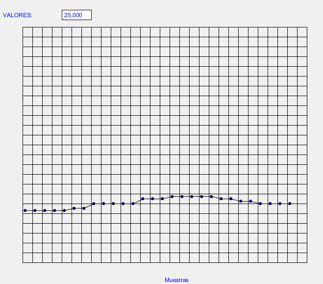
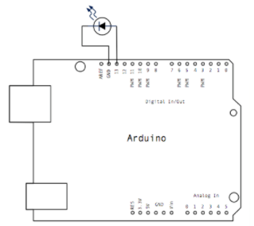
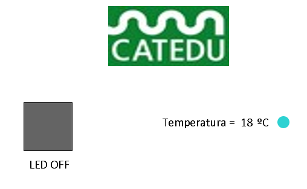

# Montaje 9 Representación gráfica de medidas con Processing.

Una vez obtenidos los datos de temperatura y humedad a través del sensor DHT11 desde Arduino, enviamos, a través del puerto serie, estos datos al PC, donde tenemos ejecutando un programa en Processing que está "escuchando" el puerto serie, obteniendo los datos y representándolos en pantalla. Simultáneamente guardamos los datos en un archivo de texto que posteriormente podremos analizar en una hoja de cálculo.

### Programa a cargar en el ARDUINO

Cargamos este programa, fíjate que sólo ponemos un valor de la temperatura, si queremos representar la humedad, quitamos el comentario de la temperatura y ponemos el de la humedad

**IMPORTANTE**: No hay que tener abierto el monitor serie del IDE de Arduino porque ocupa el puerto y, por lo tanto, no deja leer los datos a Processing.

Si fuera un DHT12 en vez de un DHT11 poner comentarios a las 4 primeras líneas delante // y quitárselas a las 3 siguientes

### 

### Programa a Cargar en PROCESING

[Aquí lo tienes](MiProgramaProcesing.rar) (rar - 1,96 <abbr title="KiloBytes" lang="en">KB</abbr>), sólo representa un valor, está puesto en el puerto 0 puertoArduino = new Serial(this, Serial.list()[0], 9600);

El resultado puedes verlo aquí abajo para la temperatura, el aumento se debe a aplicar vaho al sensor:

Otra versión más sofisticada lo tienes en [esta página ](http://diymakers.es/arduino-processing-primeros-pasos/)

## Otro programa de visualización de datos

En este caso no vamos a representar los datos en forma de gráfica, sino por colores, y además vamos a añadir un botón que encienda un LED conectado por simplicidad en el pin 13

### Programa a cargar en el ARDUINO

El programa lee la temperatura y lo escribe en el puerto serie en forma de byte. También lee el puerto serie para cambiar el estado del led.

En el Arduino tenemos que poner el sensor de temperatura y humedad tal y como se ha explicado en el Montaje 8 y además un led en el 13

### Programa en Processing

Extraido de la página [http://diymakers.es/arduino-processing-primeros-pasos/](http://diymakers.es/arduino-processing-primeros-pasos/) pero adaptado, [te lo puedes descargar aquí ](dymakers.rar) (rar - 31,02 <abbr title="KiloBytes" lang="en">KB</abbr>)(recuerda cambiar port = new Serial(this, Serial.list()[0], 9600); por tu puerto )

