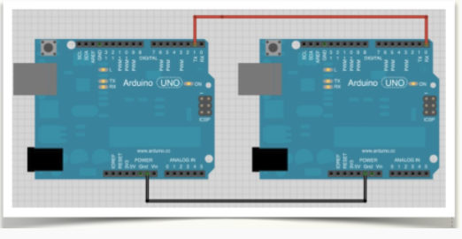
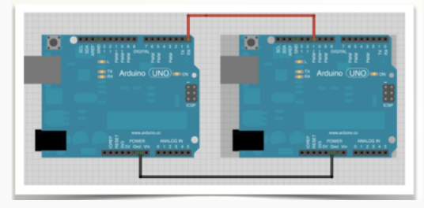

# Otras conexiones

Para la comunicación en una dirección:


 
_maestro(izquierda) -> esclavo(derecha)_ sólo necesitamos 1 conexión:

NOTA: 

Ocurre que esos pines también los usa para comunicarse por USB cuando está conectado al ordenador, de manera que si queremos tener ambas conexiones (USB/trasmisión serie) deberemos crear una nueva conexión serie (en una conexión software). Sólo podemos conectar 2 Arduinos pues sólo hay un puerto de serie en cada uno de ellos. Aunque la conexión es en un sentido, es necesario conectar los dos cables TX-RX y RX-TX

En este ejemplo, una de las Arduino la vamos a tener conectada al PC, por tanto, en el MAESTRO vamos a crear la conexión software serie sobre los pines 10(RX), 11(TX). 

Lo puedes comprobar en la siguiente imagen:



El programa sería el siguiente:

```cpp
///// MAESTRO
int i=0; 
//CREAMOS UN NUEVO PUERTO SERIE (RX, TX)
SoftwareSerial Serie2(10,11); 
void setup()
{ pinMode(13,OUTPUT);
  Serial.begin(9600);          //Inicializa puerto estándar
  Serie2.begin(9600);         //Inicializa nuevo puerto
  digitalWrite(13,LOW);
}
void loop()
{ Serie2.write("r");
  delay(3000);
  Serie2.write("l");
  delay(3000);
}
////////////////////esclavo
void setup()

{ pinMode(13,OUTPUT);
  Serial.begin(9600);
}
void loop()

{ while (Serial.available())
   {
      //Guardamos en la variable dato el valor leido
       char dato= Serial.read();
       //Comprobamos el dato
       switch(dato)
       {//Si recibimos una 'r' ...
         case 'r':
         {for(int i=0; i<20 i++)
               digitalWrite(13,HIGH);
               delay(80);
               digitalWrite(13,LOW);
               delay(80);}
           break;
         }
         case 'l':
         {for(int i=0; i<10 i++)
               digitalWrite(13,HIGH);
               delay(200);
               digitalWrite(13,LOW);
               delay(200);}
           break;
}}}}
```