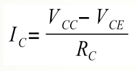
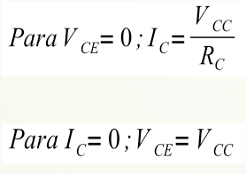
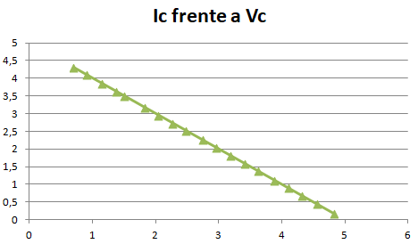
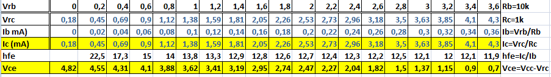

# Recta de carga de un transistor

Se trata de comprobar de forma práctica el efecto de amplificación de corriente de un transistor, así como de determinar su punto de trabajo para un determinada corriente de base y la recta de carga. El circuito es el mismo que la práctica anterior.

 La siguiente expresión se corresponde con la ecuación de la recta de carga: 

Para dibujar esta recta sobre la curva característica determinaremos primero sus extremos (IC = 0 y VCE = 0):

Te proponemos realizar los cálculos teóricos y dibujar la recta de carga en una gráfica Ic (eje y) y Vce (eje x) y sobre esta gráfica representar los puntos Ic Vce que has medido experimentalmente, utilizando las fórmulas

Te puede salir una cosa así:

