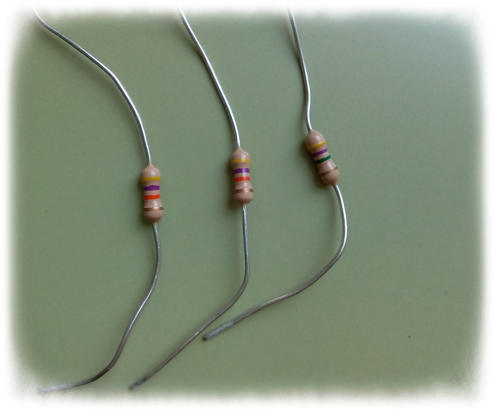

# Resistencias

Los componentes electrónicos llamados resistencias se utilizan en los circuitos para variar los valores de intensidad y voltaje. A veces tenemos que alimentar un dispositivo y sólo disponemos de una fuente de voltaje que puede dañarlo si se conecta directamente, como ocurre por ejemplo con los ledes. Al conectarlos directamente a un pin digital de Arduino (+5V), la corriente que circula es demasiado alta para el led y una exposición prolongada puede provocar que se queme. Para evitar esto conectamos en serie con el led una resistencia eléctrica (220 ohmios por ejemplo) que hace que el valor de la intensidad sea menor. El led lucirá algo menos que si lo conectamos directamente pero alargará su vida útil.

El valor de una resistencia se suele identificar mediante unas bandas de colores impresas en su superficie. La interpretación del código de colores la puedes obtener en  [http://es.wikipedia.org/wiki/Resistor](http://es.wikipedia.org/wiki/Resistor) aunque suele ser recomendable, a la hora de realizar prácticas con circuitos electrónicos, utilizar un polímero que nos permitirá, entre otras cosas, medir la resistencia eléctrica en ohmios de estos componentes.

