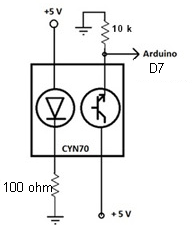
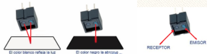

# Sensor de infrarrojos CNY70

Uno de los sensores más utilizados en robótica, o infinidad de aplicaciones industriales es el CNY-70.

Su nombre técnico es optoacoplador. Se basa en la acción conjunta de un diodo que emite una luz infrarroja (que no vemos) y un fototransistor que detecta el rebote de esta cuando incide sobre algún objeto. 

Inicialmente es un sensor analógico y nos da un valor de voltaje proporcional a la luz rebotada, pero podemos utilizarlo también de manera digital. El transistor y el diodo hay que alimentarlo a través de una resistencia, el diodo del orden de Ohmios para dar una señal razonable y el transistor del orden de k para que trabaja en la zona activa.

Su funcionamiento es sencillo, si el receptor recibe la señal del emisor, el transistor conduce, por lo que recibiremos un '1' lógico en el Arduino:

# Conocimiento previo

- Programación básica de Arduino.
- Sentencia condicional if-else.
- Comunicación serie.

# Objetivos

- Conocer el manejo y aplicaciones del sensor CNY 70
- Realizar las conexiones necesarias sobre el sensor IR.
- Crear un programa para Arduino que obtenga la información proporcionada por el sensor.

Lista de materiales:

-  Placa Arduino.
- CNY 70
- Resistencias 10KOhmios (valor orientativo).
- Resistencia de 200 Ohmios (valor orientativo).
- Placa de pruebas.

Vamos a ver una demostración del funcionamiento del sensor:

<video width="320" height="240" class="mediaelement" src="Infrared_CNY70_Arduino_-_music.mp4" controls="controls">[Infrared CNY70 Arduino - music.mp4](Infrared_CNY70_Arduino_-_music.mp4)</video>

