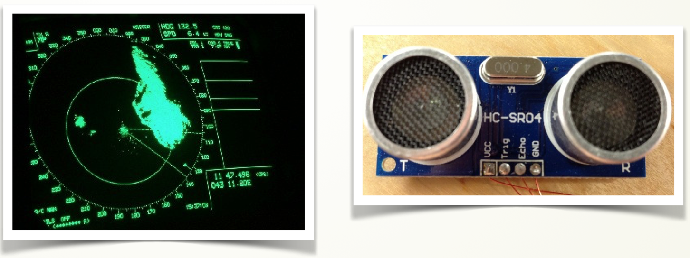

# Sensor de ultrasonidos

# Conocimiento previo

Programación básica de Arduino, escritura en puerto serie.

# Objetivos

Manejar este tipo de sensores que son muy comunes en las aplicaciones de robótica para medir distancias. Para ello aprenderás a:

- Realizar las conexiones necesarias sobre el sensor ultrasonidos HC-SR04.
- Conocer el funcionamiento de un radar.
- Cómo convertir el tiempo de rebote de un sonido en distancia.

La lista de materiales necesaria para el montaje es:

- Arduino UNO.
- Sensor de ultrasonidos HC-SR04.
- Protoboard.
- Cableado.

