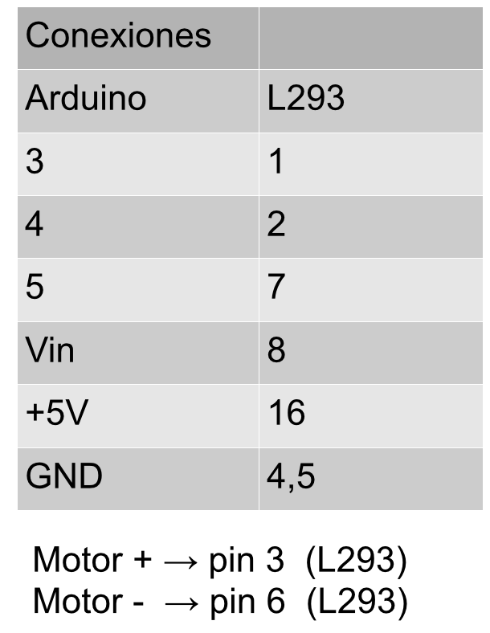

# Sin Edubásica

Vamos a ver de qué manera se pueden activar los motores DC para hacer una secuencia sencilla de giro. Primero de todo vamos a ver cómo se conecta todo.

Las conexiones del circuito integrado según podemos ver en la hoja de datos del fabricante son las siguientes:

> Vcc2(VC), pin 8 del L293:  El voltaje que se introduzca aquí alimentará a los motores (Vin de Arduino).

> Vcc1(VSS), pin 18 del L293: El voltaje que se introduzca aquí alimentará al propio circuito integrado (+5V de Arduino).

Las conexiones del circuito con Arduino las podemos ver en el siguiente esquema:

Vamos a detallar la correspondencia entre pines de Arduino y del circuito L293

Para saber la orientación del sentido de giro disponemos de la siguiente tabla de verdad:

