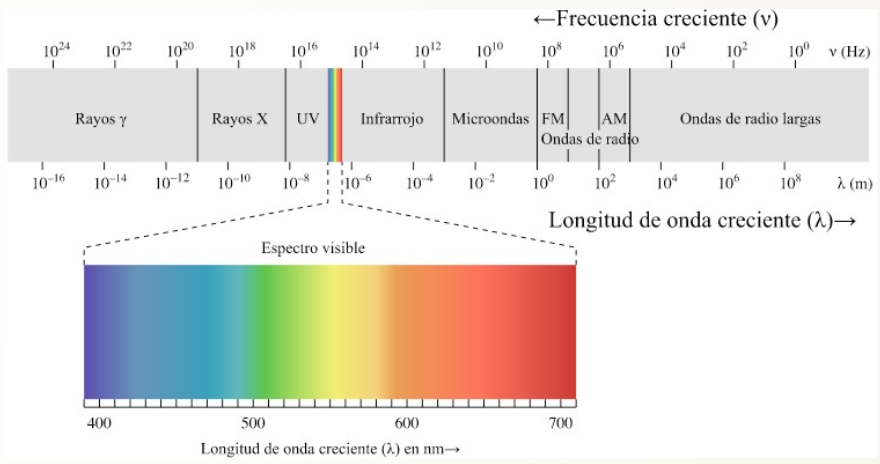
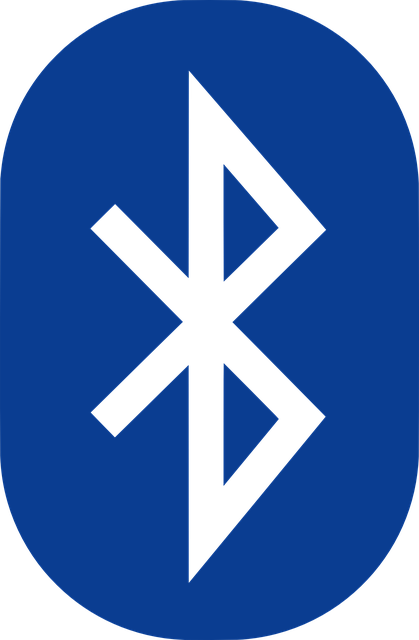
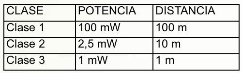
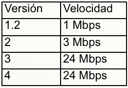

# Teoría Bluetooth

**ONDAS:**

Una onda es una señal que se propaga por un medio. Por ejemplo el sonido, que es una onda mecánica que viaja usando el aire o cualquier otro material. Pero en el caso de las señales eléctricas pueden ser enviadas por el cable o a través del vacío (no necesitan un medio para transmitirse).

Dependen de 3 parámetros principalmente:

**Amplitud:** altura máxima de la onda. Hablando de sonido representaría el volumen. Si nos referimos a una onda eléctrica estaríamos representando normalmente el voltaje.

**Longitud de onda λ:** distancia entre el primer y último punto de un ciclo de la onda (que normalmente se repite en el tiempo).

**Frecuencia f :** Número de veces que la onda repite su ciclo en 1 segundo (se mide en hertzios).

**Periodo T ** es simplemente es la inversa de la frecuencia. T=1/f

La relación entre ellas es muy fácil pues las ondas electromagnéticas viajan a la velocidad de la luz c y si velocidad es espacio/tiempo luego c = λ/T luego **c= λ*f**

Dentro del espectro electromágnético encontramos diferentes tipos de señales dependiendo de las características de su onda.

**TRANSMISIÓN INALÁMBRICA: BLUETOOTH.**

- Hoy en día, este grupo está formado por miles de empresas y se utiliza no sólo para teléfonos sino para cientos de dispositivos.
- Su curioso nombre viene de un antiguo rey Noruego y Danés, y su símbolo, de las antiguas ruinas que representan ese mismo nombre. 
- Bluetooth es una red inalámbrica de corto alcance pensada para conectar pares de dispositivos y crear una pequeña red punto a punto, (sólo 2 dispositivos).
- Utiliza una parte del espectro electromagnético llamado “Banda ISM”, reservado para fines no comerciales de la industria, área científica y medicina. Dentro de esta banda también se encuentran todas las redes WIFI que usamos a diario. En concreto funcionan a 2,4GHz.

Hay 3 clases de bluetooth que nos indican la máxima potencia a la que emiten y por tanto la distancia máxima que podrán alcanzar:

También es muy importante la velocidad a la que pueden enviarse los datos con este protocolo:

Recuerda que:

- Mbps : Mega Bits por segundo.
- MBps: Mega Bytes por segundo.

# ¿Te atreves a calcularlo .... ?

¿Cuantos ciclos por segundo tendrán las ondas que están en la Banda ISM?

¿Cuál es el periodo de esas ondas?

# ¿Te atreves a calcularlo...?

¿A qué distancia y cuanto tiempo tardarían en enviarse los siguientes archivos por Bluetooth?

1. Un vídeo de 7Mb usando versión 2 clase 2
1. Una imagen de 2.5Mb usando versión 3 clase 1
1. Un archivo de texto de 240KB usando versión 1 clase 1

