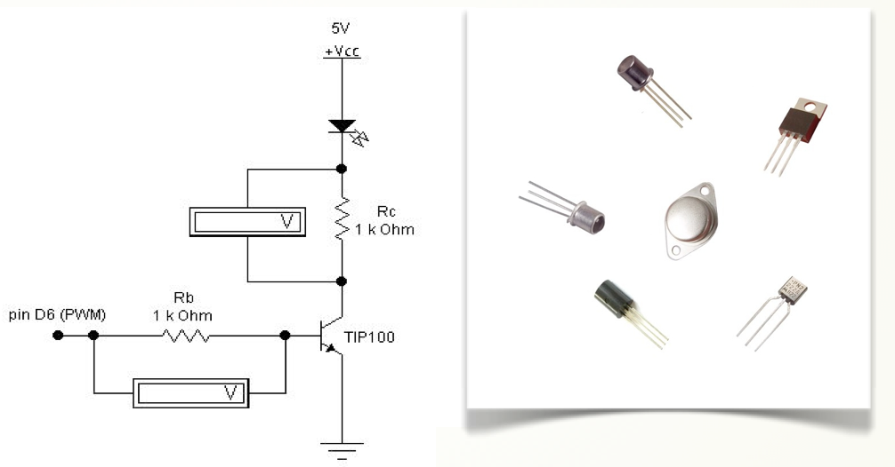

# Transistores

Ciertos dispositivos tecnológicos necesitan una corriente eléctrica mayor que la que proporciona la placa EduBásica y para ello se utiliza el transistor.

**El transistor** es sin duda el componente electrónico más importante. Está formado por 3 capas de material semiconductor, cada una con un terminal metálico para poder conectarlo a los circuitos. Los materiales semiconductores se pueden comportar como aislantes o conductores según la energía que reciban, de ahí su versatilidad en el campo de la electrónica. Los 3 terminales de los transistores son:

**Colector:** Entrada de corriente.

**Base:** Entrada de corriente. Regula el funcionamiento.

**Emisor:** Salida de corriente.

Según la forma en la que conectemos los terminales del transistor a resistencias externas éste puede funcionar de 3 formas:

El funcionamiento típico en circuitos de señales **ANALÓGICAS **

Como **funcionamiento en zona “activa”** : La resistencia conectada a la base del transistor tiene un valor que permite circular corriente a través de ella. De esta manera hay circulación de corriente entre el colector y emisor cuyo valor será proporcional a la corriente que circula por la base. Normalmente mucho mayor  con lo que producirá el efecto de amplificación. 

En resumen: El transistor actúa como un ****amplificador de corriente  ****

La ganancia de corriente β también llamado **hfe**, se calcula dividiendo la corriente de colector con la corriente de base,

Los funcionamientos típicos de circuitos **DIGITALES**

Como **interruptor abierto o en “corte”**: Si la corriente que circula por la base es nula, normalmente debido a que se conecta a ella una resistencia de un valor muy elevado, el transistor no permite el paso de corriente entre colector y emisor.

**Como interruptor cerrado en zona de “saturación”**: Si se va aumentando la intensidad que circula por la base llega un momento que la intensidad entre colector y emisor ya no aumenta más; es decir, se satura.

