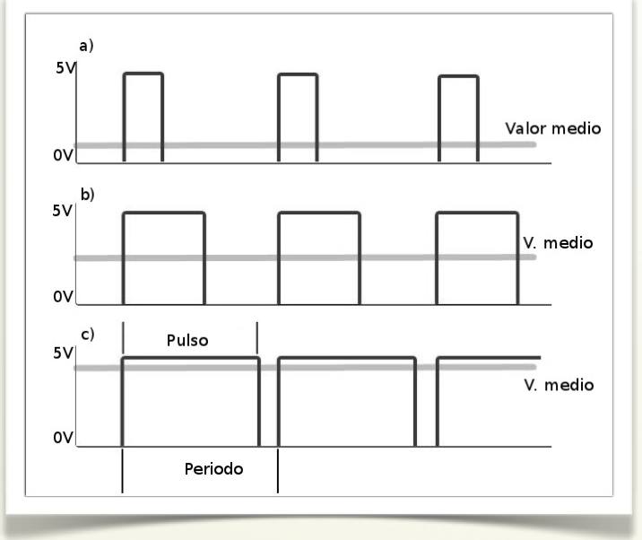

# Un caso especial: Señales PWM

La señal PWM (Pulse Width Modulation, Modulación de Ancho de Pulso) es una señal que utiliza el microcontrolador para generar una señal continua sobre el proceso a controlar. Por ejemplo, la variación de la intensidad luminosa de un led, el control de velocidad de un motor de corriente continua,...

Para que un dispositivo digital, microcontrolador de la placa Arduino, genere una señal continua lo que hace es emitir una señal cuadrada con pulsos de frecuencia constante y tensión de 5V. A continuación, variando la duración activa del pulso (ciclo de trabajo) se obtiene a la salida una señal continua variable desde 0V a 5V.

Veamos gráficamente la señal PWM:

Los pines digitales de la placa Arduino que se utilizan como salida de señal PWM generan una señal cuadrada de frecuencia constante (490Hz), sobre esta señal periódica por programación podemos variar la duración del pulso como vemos en estos 3 casos:

- La duración del pulso es pequeña y la salida va a tener un valor medio de tensión bajo, próximo a 0V.
- La duración del pulso es casi la mitad del período de la señal, por tanto, la salida va a tener un valor medio de tensión próximo a 2,5V.
- La duración del pulso se aproxima al tiempo del período y el valor medio de tensión de salida se aproxima a 5V.

