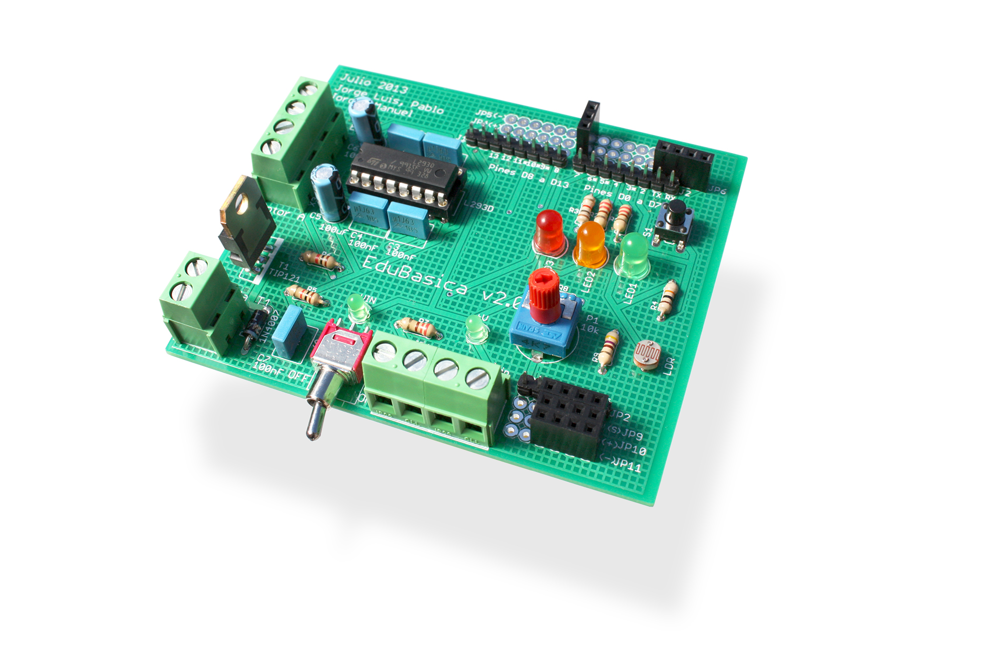

# Una placa de apoyo: Edubásica

**EDUBASICA** es una tarjeta de prototipado rápido para conectar a Arduino. Incluye componentes electrónicos básicos para gran varieda de prácticas y proyectos. Es una tarjeta multipropósito con componentes electrónicos incluidos que puedes usar para fabricar un robot, controlar un sistema de poleas, activar barreras, comunicar dispositivos bluetooth, y todo lo que te puedas imaginar.

+ información en [http://www.practicasconarduino.com](http://www.practicasconarduino.com/edubasica/)

[+Grande (jpg - 335,78 )](http://aularagon.catedu.es/materialesaularagon2013/Arduino-codigo/1_Fundamentos_arduino_y_Edubasica/tarjeta.jpg)

**ESQUEMAS Y PCB PARA SU FABRICACIÓN:**

Disponemos de un repositorio de github para la descarga de los esquemas de Edubásica [https://github.com/jorgeroden/edubasica](https://github.com/jorgeroden/edubasica). En él se incluyen las posibles modificaciones de la placa junto a los programas de test. En cualquier caso los esquemas para la última versión, en el momento de redactar este manual, se adjuntan aquí.

- [Esquema](http://aularagon.catedu.es/materialesaularagon2013/Arduino-codigo/1_Fundamentos_arduino_y_Edubasica/ESQUEMA.png)
- [Placa PCB](http://aularagon.catedu.es/materialesaularagon2013/Arduino-codigo/1_Fundamentos_arduino_y_Edubasica/PCB.png)
- [Prácticas](https://github.com/clubroboticagranada/recursos/tree/master/edubasica)
- [Proyectos](https://github.com/leobotmanuel/ProgramandoObjetosTecnologicos)

<a class="twitter-timeline" href="https://twitter.com/EduBasicaShield?ref_src=twsrc%5Etfw">Tweets by EduBasicaShield</a> 

