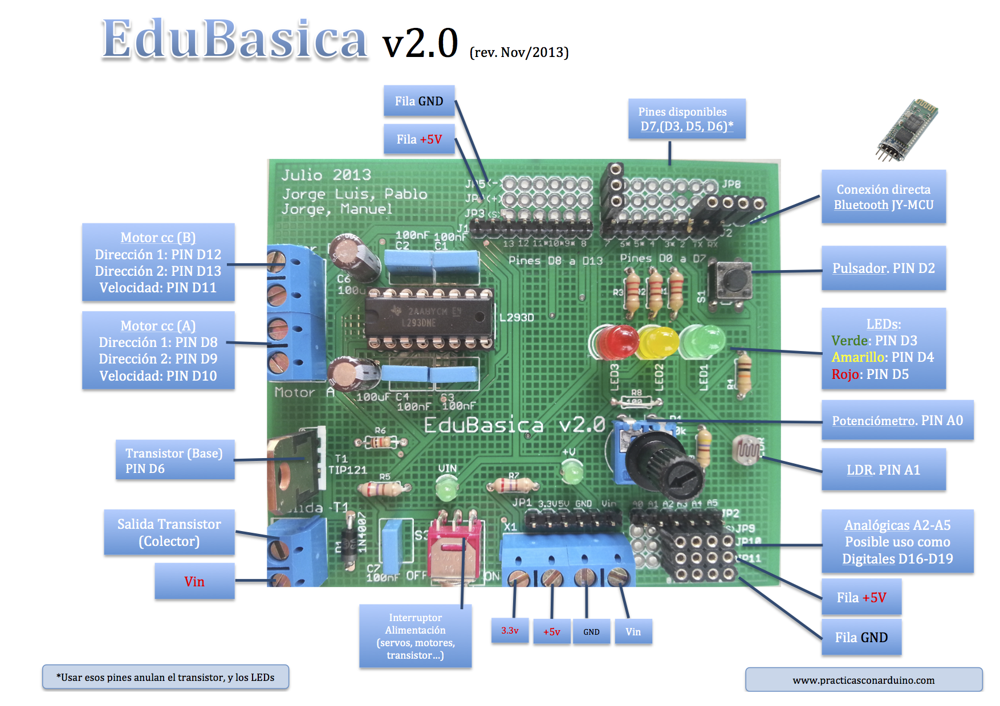

# Una placa de apoyo: Edubásica

**EDUBASICA** es una tarjeta de prototipado rápido para conectar a Arduino. Incluye componentes electrónicos básicos para gran varieda de prácticas y proyectos. Es una tarjeta multipropósito con componentes electrónicos incluidos que puedes usar para fabricar un robot, controlar un sistema de poleas, activar barreras, comunicar dispositivos bluetooth, y todo lo que te puedas imaginar.

+ información en [http://www.practicasconarduino.com](http://www.practicasconarduino.com/edubasica/)

[[+Grande](tarjeta.jpg) (jpg - 335,78 <abbr title="KiloBytes" lang="en">KB</abbr>) ]

**ESQUEMAS Y PCB PARA SU FABRICACIÓN:**

** **Disponemos de un repositorio de github para la descarga de los esquemas de Edubásica [https://github.com/jorgeroden/edubasica](https://github.com/jorgeroden/edubasica). En él se incluyen las posibles modificaciones de la placa junto a los programas de test. En cualquier caso los esquemas para la última versión, en el momento de redactar este manual, se adjuntan aquí.

- [Esquema ](ESQUEMA.png) (png - 28,84 <abbr title="KiloBytes" lang="en">KB</abbr>)
- [Placa PCB](PCB.png) (png - 76,00 <abbr title="KiloBytes" lang="en">KB</abbr>)

